# EVIDENCIA DE APRENDIZAJE  
# Simulación de Flujo CI/CD con Jenkins, Git y Automatización de Despliegues

## Aprendiz
Valery Trujillo Quintero

## Fecha
20 de mayo de 2026

---

# 1. Introducción

En esta actividad se desarrolló una simulación práctica de integración continua utilizando Jenkins, GitHub y Docker, con el propósito de automatizar procesos de compilación, validación y ejecución de pruebas dentro de un entorno CI/CD.

A diferencia de prácticas anteriores, en esta simulación se trabajó un flujo más cercano a un entorno real de desarrollo, incluyendo creación de ramas, errores controlados, conflictos de merge, correcciones iterativas y automatización mediante Webhooks.

El ejercicio permitió comprender cómo Jenkins responde automáticamente ante cambios realizados en un repositorio remoto y cómo se integran herramientas de automatización dentro del ciclo de desarrollo de software.

---

# 2. Objetivos

## Objetivo General

Simular un entorno de integración continua utilizando Jenkins para automatizar procesos de validación y despliegue del proyecto.

## Objetivos Específicos

- Configurar Jenkins utilizando Docker.
- Integrar Jenkins con GitHub.
- Automatizar compilaciones y pruebas.
- Simular errores controlados dentro del pipeline.
- Validar el comportamiento de Jenkins ante distintos estados.
- Trabajar con ramas y merges.
- Configurar Webhooks para automatización del pipeline.
- Implementar notificaciones automáticas mediante Discord.

---

# 3. Herramientas Utilizadas

| Herramienta | Función |
|---|---|
| Docker | Contenedor para Jenkins |
| Jenkins | Automatización CI/CD |
| Git | Control de versiones |
| GitHub | Repositorio remoto |
| Maven | Compilación y pruebas |
| Java | Lenguaje del proyecto |
| Discord | Notificaciones automáticas |
| Webhooks | Automatización de ejecución |

---

# 4. Escenario de Simulación

Se trabajó con un repositorio conectado a Jenkins mediante Webhooks.

## Estructura de ramas utilizada

```txt
main
dev
feature/login-ui
feature/auth-error
```

## Objetivo del escenario

Simular un flujo de trabajo colaborativo donde diferentes desarrolladores realizan cambios simultáneos sobre el proyecto.

---

# 5. Instalación y Configuración de Jenkins

## Creación del volumen persistente

```bash
docker volume create jenkins_home
```

## Ejecución de Jenkins en Docker

```bash
docker run -d --name jenkins -p 8080:8080 -p 50000:50000 -v jenkins_home:/var/jenkins_home -v //var/run/docker.sock:/var/run/docker.sock jenkins/jenkins:lts
```

## Verificación del contenedor

```bash
docker ps
```

## Imagen 1
**Contenedor Jenkins ejecutándose**

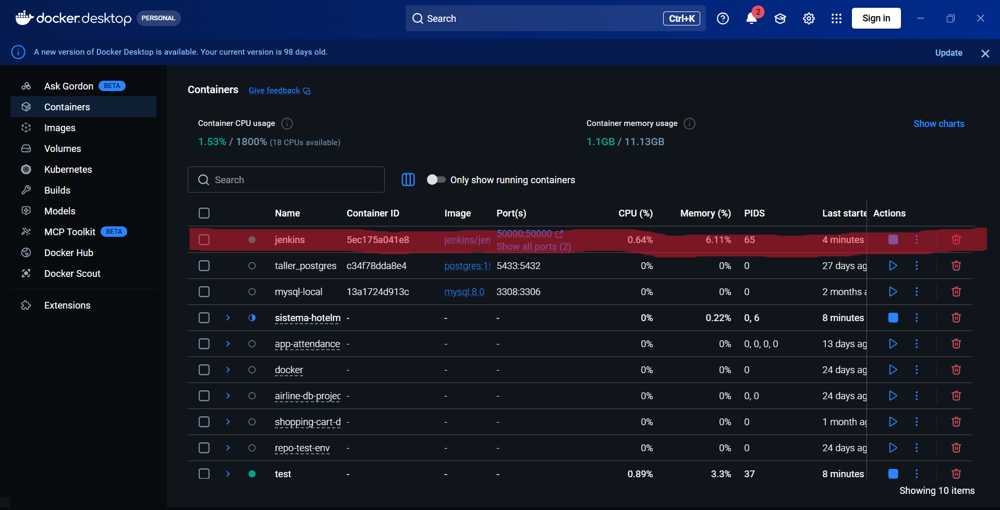

```

---

# 6. Acceso Inicial a Jenkins

Abrir desde navegador:

```txt
http://localhost:8080
```

## Obtener contraseña inicial

```bash
docker exec jenkins cat /var/jenkins_home/secrets/initialAdminPassword
```

## Imagen 2
**Pantalla inicial de Jenkins**

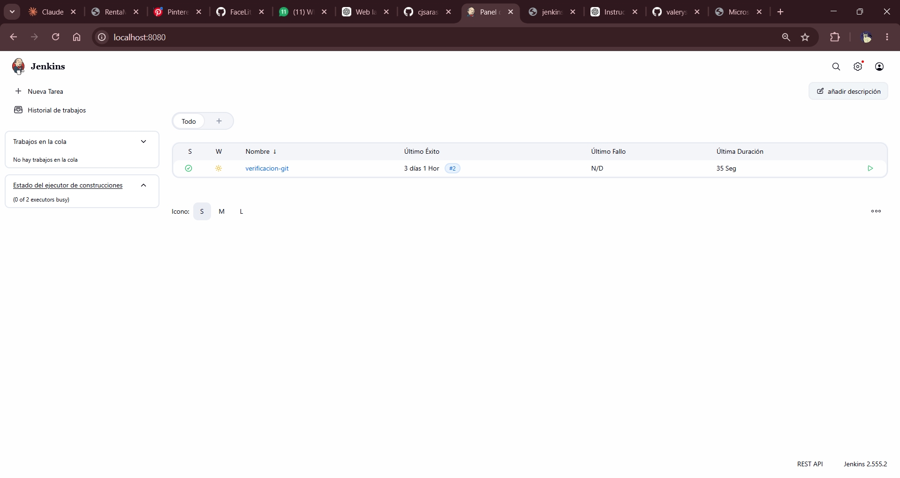

---

# 7. Instalación de Plugins

Se instalaron los siguientes plugins:

- Git
- Pipeline
- GitHub Integration
- Maven Integration
- Mailer
- Discord Notifier


---

# 8. Configuración de Maven

## Entrar al contenedor

```bash
docker exec -u 0 -it jenkins bash
```

## Actualizar paquetes

```bash
apt update
```

## Instalar Maven

```bash
apt install maven -y
```

## Verificar instalación

```bash
mvn -version
```

## Imagen 4
**Maven instalado correctamente**

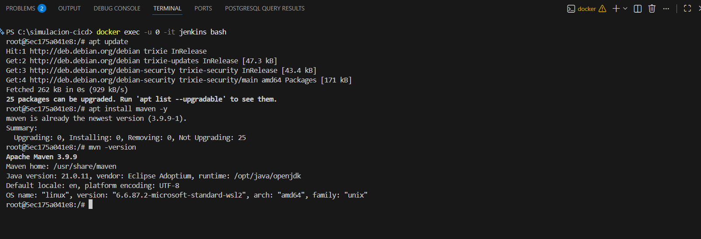

---

# 9. Creación del Pipeline

Se creó un Job tipo Pipeline llamado:

```txt
verificacion-git
```

## Pipeline utilizado

```groovy
pipeline {

    agent any

    stages {

        stage('Clonar repositorio') {

            steps {

                git branch: 'dev',
                url: 'https://github.com/TU-USUARIO/simulacion-cicd.git'

            }
        }

        stage('Compilar') {

            steps {

                sh 'mvn clean compile'

            }
        }

        stage('Pruebas') {

            steps {

                sh 'mvn test'

            }
        }
    }

    post {

        success {

            echo 'Build exitoso'

            discordSend description: 'Build SUCCESS'

        }

        failure {

            echo 'Build fallido'

            discordSend description: 'Build FAILED'

        }
    }
}
```

## Imagen 5
**Pipeline configurado**

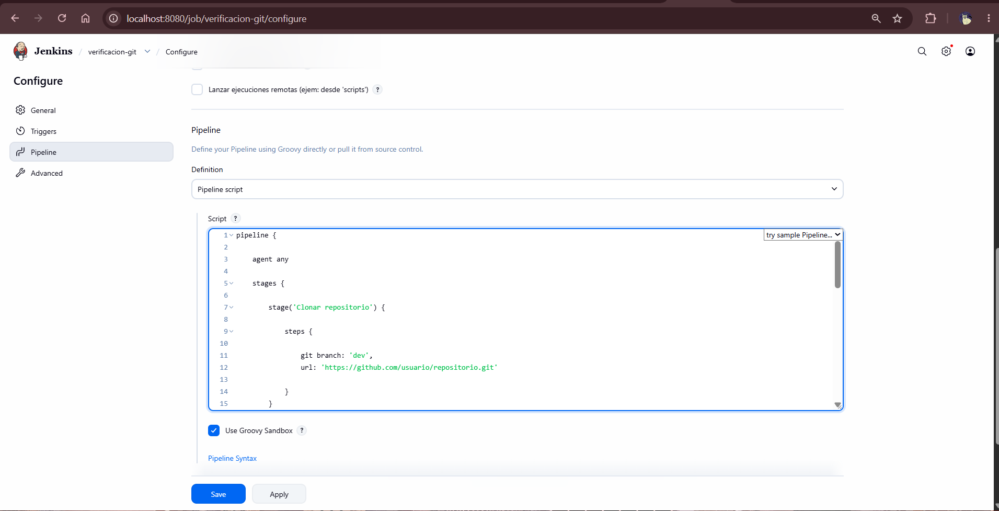

---

# 10. Simulación de Cambios

## Iteración 1 – Cambio funcional básico

### Actividades realizadas

- Creación de rama:

```txt
feature/login-ui
```

- Modificación de interfaz de login.
- Commit y Push al repositorio.
- Jenkins ejecutó automáticamente el pipeline.

### Resultado

```txt
SUCCESS
```

## Imagen 6
**Build exitoso**

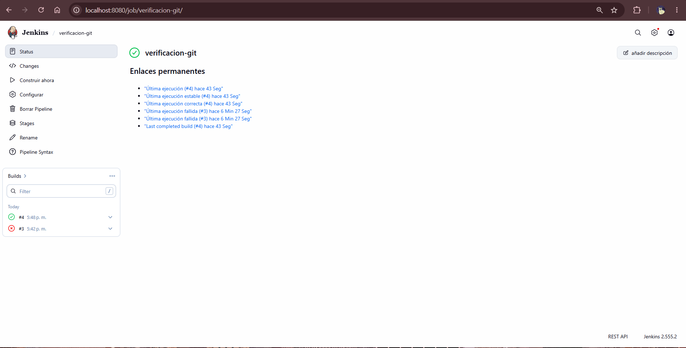

---

## Iteración 2 – Error intencional

### Actividades realizadas

- Creación de rama:

```txt
feature/auth-error
```

- Se introdujo un error de compilación.
- Push al repositorio remoto.
- Jenkins ejecutó automáticamente el pipeline.

### Resultado

```txt
FAILED
```

### Evidencias

- Error detectado durante compilación.
- Pipeline detenido automáticamente.
- Jenkins marcó fallo en el build.

## Imagen 7
**Pipeline fallido**

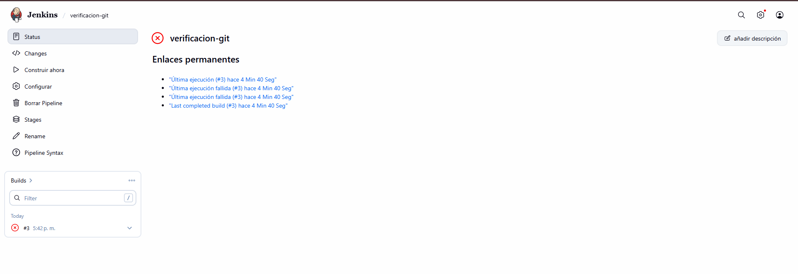


---

## Iteración 3 – Corrección del error

### Actividades realizadas

- Corrección del error generado.
- Nuevo commit y push.
- Reejecución automática del pipeline.

### Resultado

```txt
SUCCESS
```

## Imagen 8
**Corrección exitosa**

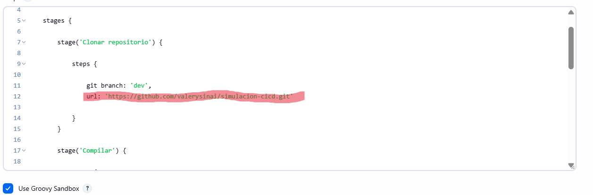

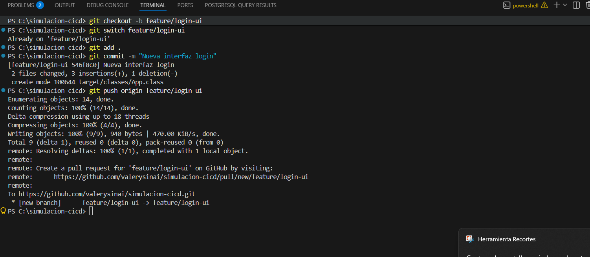

---

## Iteración 4 – Conflicto de Merge

### Actividades realizadas

- Merge entre ramas:

```txt
feature/login-ui
feature/auth-error
```

- Conflicto generado manualmente.
- Resolución manual del conflicto.
- Push hacia rama dev.

### Resultado

```txt
UNSTABLE
```

## Imagen 9
**Conflicto de merge y resolución**

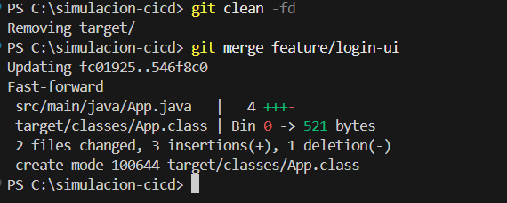

---

## Iteración 5 – Integración Final

### Actividades realizadas

- Se realizó el merge final de las ramas feature hacia la rama dev.
- Jenkins ejecutó automáticamente el pipeline tras detectar cambios en el repositorio.
- Se validó la compilación del proyecto y la ejecución de pruebas.
- El pipeline terminó correctamente sin errores críticos.

### Resultado

```txt
SUCCESS
```

## Imagen 10
**Pipeline final exitoso**


---

# 11. Comportamiento del Pipeline

Durante la simulación, Jenkins ejecutó automáticamente las siguientes etapas:

- Clonación del repositorio
- Compilación del proyecto
- Ejecución de pruebas
- Validación del código
- Generación del estado del build

---

# 12. Estados del Pipeline

| Estado | Descripción |
|---|---|
| SUCCESS | Ejecución correcta |
| FAILED | Error en compilación o pruebas |
| UNSTABLE | Advertencias o conflictos menores |

---

# 13. Notificaciones Automáticas

Durante la práctica se investigó el funcionamiento de las notificaciones automáticas en Jenkins, permitiendo informar el estado de ejecución del pipeline en tiempo real.

Las notificaciones pueden configurarse mediante diferentes servicios externos como:

- Correo electrónico SMTP
- Discord
- Telegram
- Microsoft Teams

Estas integraciones permiten recibir alertas automáticas cuando un build termina en estado SUCCESS, FAILED o UNSTABLE.

---

## Configuración de Discord Notifications

### Paso 1 – Crear servidor en Discord

Se creó un servidor en Discord con un canal llamado:

```txt
jenkins-alerts
```

---

### Paso 2 – Crear Webhook

Dentro del canal de Discord se accedió a:

```txt
Editar canal → Integraciones → Webhooks
```

Luego se creó un nuevo Webhook para permitir que Jenkins enviara mensajes automáticos al canal.

## Imagen 11
**Creación del Webhook en Discord**

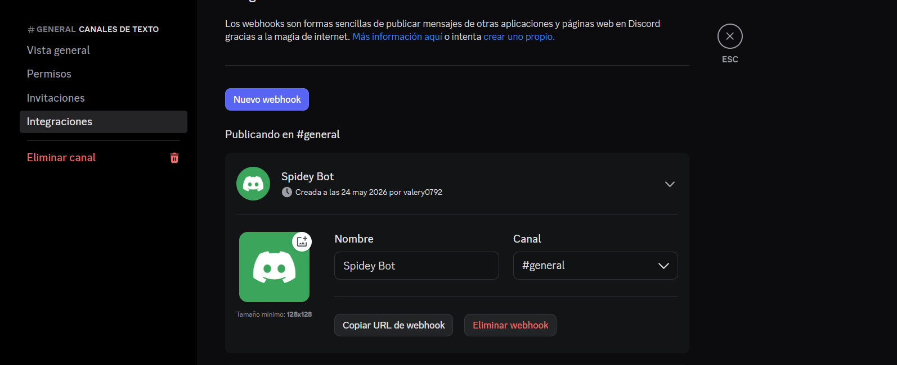

---

### Paso 3 – Instalación del Plugin en Jenkins

En Jenkins se ingresó a:

```txt
Administrar Jenkins → Plugins
```

Se instaló el plugin:

```txt
Discord Notifier
```

## Imagen 12
**Plugin Discord Notifier instalado**

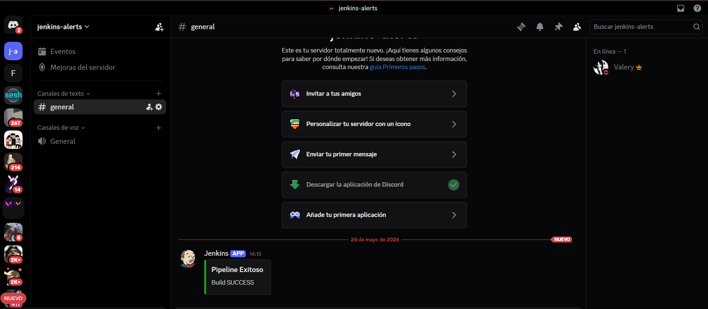


---

### Paso 4 – Configuración del Webhook en Jenkins

En la configuración global de Jenkins se agregó la URL del Webhook generado en Discord.

Ruta utilizada:

```txt
Administrar Jenkins → System → Discord Notifications
```


### Paso 5 – Configuración del Pipeline

Dentro del Jenkinsfile se agregaron acciones automáticas para enviar mensajes según el estado del pipeline.

```groovy
post {

    success {

        discordSend description: "Build SUCCESS"

    }

    failure {

        discordSend description: "Build FAILED"

    }
}
```

---

### Paso 6 – Ejecución del Pipeline

Al ejecutar el pipeline, Jenkins envió automáticamente notificaciones al canal de Discord indicando el resultado del build.

Estados notificados:

- SUCCESS
- FAILED

## Imagen 14
**Notificación automática en Discord**


---

## Resultado Obtenido

Se logró integrar Jenkins con Discord mediante Webhooks y el plugin Discord Notifier, permitiendo el envío automático de alertas sobre el estado de cada ejecución del pipeline.

Las notificaciones mostraron correctamente eventos SUCCESS y FAILED en tiempo real dentro del canal configurado en Discord.

Esta integración facilitó el monitoreo continuo del flujo CI/CD y permitió identificar rápidamente errores y ejecuciones exitosas.

---

# 14. Notificaciones por Correo Electrónico

Además de Discord, Jenkins permite enviar notificaciones automáticas mediante correo electrónico para informar el estado del pipeline.

Estas notificaciones son útiles para:

- Informar errores automáticamente.
- Validar ejecuciones exitosas.
- Monitorear pipelines de forma remota.
- Mantener seguimiento continuo del proyecto.

---

## Configuración SMTP en Jenkins

Para configurar el envío de correos se ingresó a:

```txt
Administrar Jenkins → Configuración del Sistema
```

En la sección:

```txt
Notificación por correo electrónico
```

se configuró el servidor SMTP de Gmail.

---

## Configuración utilizada

| Campo | Valor |
|---|---|
| SMTP Server | smtp.gmail.com |
| Puerto SMTP | 465 |
| Usar SSL | Sí |
| Usar TLS | No |
| Usuario | correo@gmail.com |
| Contraseña | Contraseña de aplicación |

---

## Imagen 15
**Configuración SMTP en Jenkins**

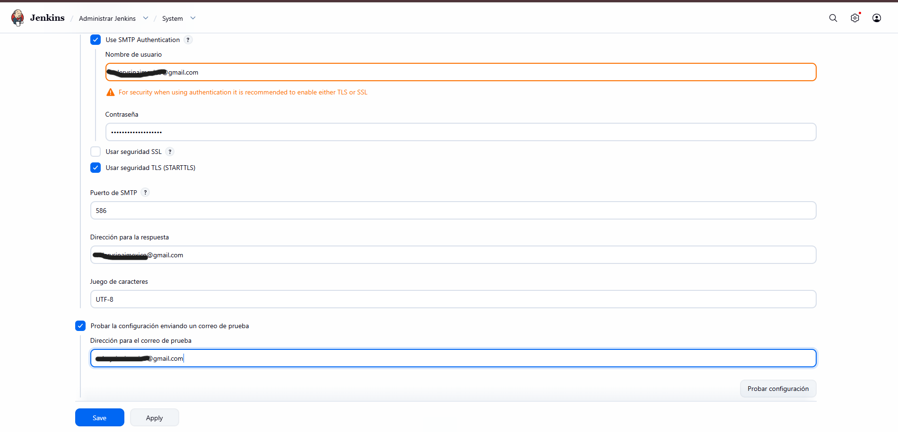
---

## Generación de Contraseña de Aplicación

Para permitir el acceso desde Jenkins fue necesario generar una contraseña de aplicación desde la cuenta de Google.

Ruta utilizada:

```txt
Cuenta de Google → Seguridad → Verificación en dos pasos → Contraseñas de aplicaciones
```

Se generó una contraseña específica para Jenkins.

## Imagen 16
**Contraseña de aplicación generada**

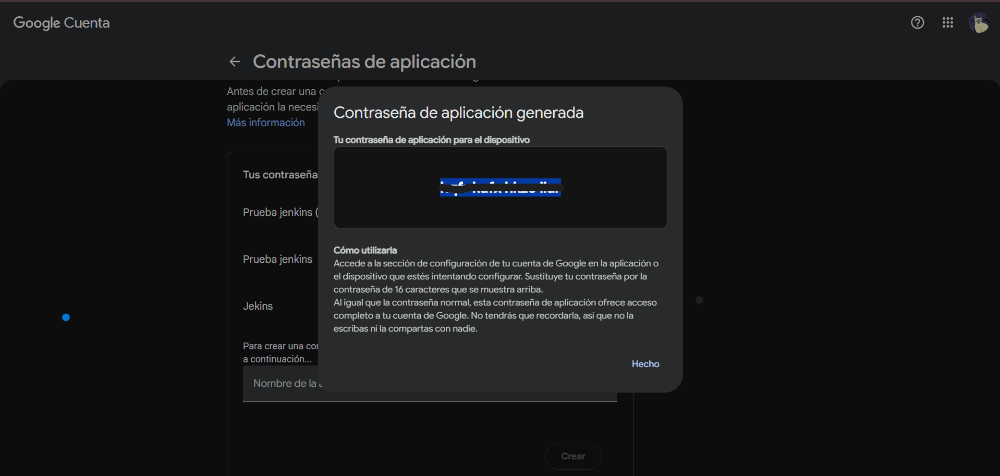

---

## Configuración del Pipeline para Correo

Dentro del Jenkinsfile se agregaron acciones automáticas para enviar correos según el resultado del pipeline.

```groovy
post {

    success {

        mail to: 'correo@gmail.com',
        subject: 'Build SUCCESS',
        body: 'La ejecución del pipeline fue exitosa.'

    }

    failure {

        mail to: 'correo@gmail.com',
        subject: 'Build FAILED',
        body: 'La ejecución del pipeline presentó errores.'

    }
}
```

---

## Ejecución de Prueba

Se ejecutó nuevamente el pipeline para validar el envío automático de correos.

Estados evaluados:

- SUCCESS
- FAILED

Jenkins envió automáticamente mensajes al correo configurado con el estado de cada build.

---

## Imagen 17
**Correo recibido automáticamente**

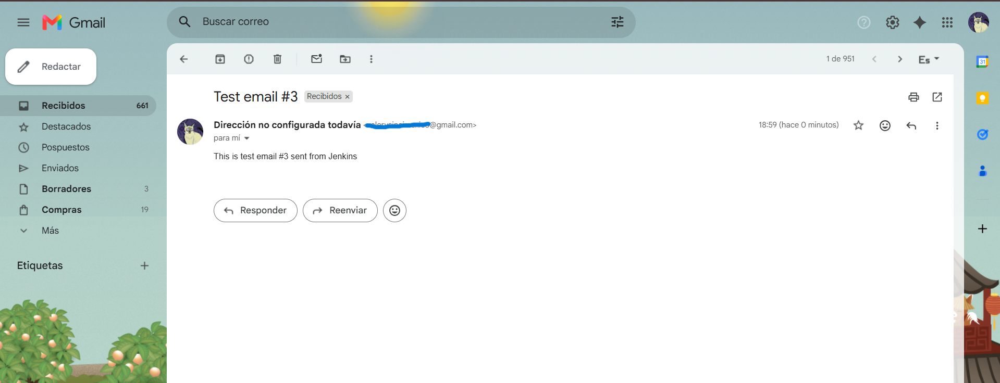

---

## Resultado Obtenido

Se logró integrar Jenkins con el servicio SMTP de Gmail para enviar notificaciones automáticas por correo electrónico.

Esto permitió monitorear ejecuciones del pipeline sin necesidad de ingresar directamente a Jenkins.

---

# 15. Notificaciones Automáticas con Telegram

Durante la práctica también se integró Telegram como sistema de notificaciones automáticas para Jenkins.

Esto permitió recibir mensajes directamente desde un bot de Telegram cada vez que el pipeline terminaba en estado FAILED.

---

## Paso 1 – Crear Bot en Telegram

Se utilizó el bot oficial:

```txt
@BotFather
```

Comando utilizado:

```txt
/newbot
```

Luego se configuró:

- Nombre del bot
- Username del bot

Finalmente, Telegram generó un Token de acceso para utilizar la API.

## Imagen 15
**Creación del bot en Telegram**

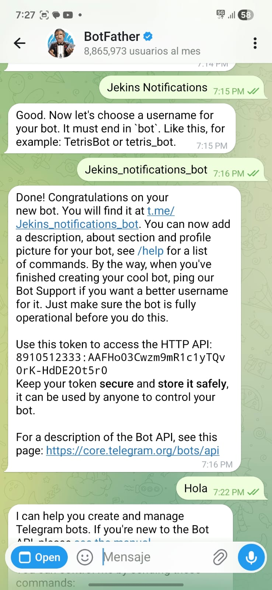


---

## Paso 2 – Obtener Chat ID

Se envió un mensaje al bot desde Telegram:

```txt
Hola
```

Posteriormente se consultó la API:

```txt
https://api.telegram.org/botTOKEN/getUpdates
```

La respuesta permitió obtener el `chat_id` necesario para enviar mensajes automáticamente.

## Imagen 16
**Obtención del Chat ID**


---

## Paso 3 – Configuración dentro del Pipeline

Se agregó una llamada HTTP utilizando `curl` dentro del Jenkinsfile para enviar mensajes automáticamente hacia Telegram.

Código implementado:

```groovy
sh '''
curl -s -X POST https://api.telegram.org/botTOKEN/sendMessage \
-d chat_id=CHAT_ID \
-d text="❌ Build fallido en Jenkins"
'''
```

---

## Error Presentado Durante la Configuración

Inicialmente se presentó un error en Jenkins relacionado con problemas de sintaxis dentro del Jenkinsfile.

### Error generado

```txt
expecting ''', found '\n'
```

Este error ocurrió debido a una comilla mal cerrada dentro de la configuración del correo electrónico en el bloque `emailext`.

## Imagen 17
**Error de sintaxis en Jenkins**


---

## Segundo Error Presentado

Posteriormente Jenkins presentó un error al intentar clonar el repositorio desde GitHub.

### Error generado

```txt
fatal: repository not found
```

El problema ocurrió porque la URL del repositorio fue escrita incorrectamente dentro del Jenkinsfile.

URL incorrecta:

```txt
https://github.com/https://github.com/valerysinai/simulacion-cicd.git
```

Se corrigió dejando únicamente la URL válida del repositorio.

## Imagen 18
**Error al clonar repositorio**

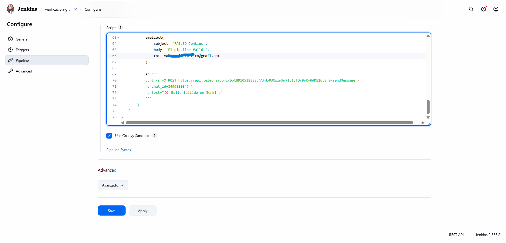

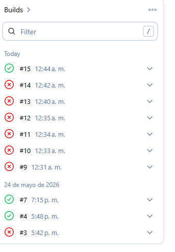

---

## Corrección Aplicada

Después de corregir:

- La sintaxis del Jenkinsfile
- La URL del repositorio GitHub

Jenkins logró ejecutar correctamente el pipeline y enviar automáticamente el mensaje hacia Telegram.

---

## Resultado Final

Telegram recibió correctamente la notificación automática enviada desde Jenkins.

Mensaje recibido:

```txt
❌ Build fallido en Jenkins
```

## Imagen 19
**Notificación recibida en Telegram**

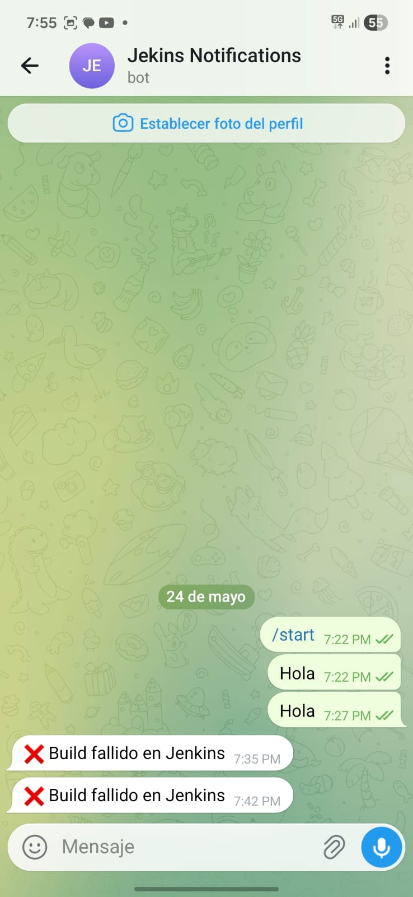

---

## Resultado Obtenido

Se logró integrar Jenkins con Telegram para enviar notificaciones automáticas sobre el estado del pipeline.

Esto permitió ampliar el monitoreo del flujo CI/CD mediante múltiples canales de comunicación en tiempo real.

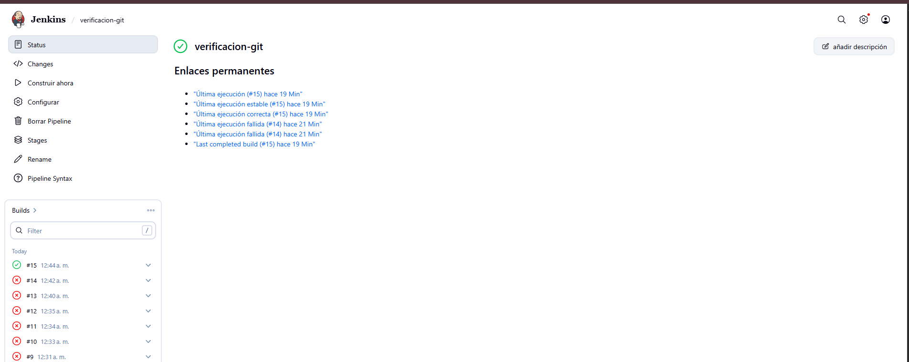

---

# 16. Evaluación de Integración con Microsoft Teams

Se intentó integrar Jenkins con Microsoft Teams para recibir notificaciones automáticas del pipeline.

Se creó una comunidad llamada:

```txt
jenkins-alerts
```

Sin embargo, no fue posible completar la integración debido a que la versión de Microsoft Teams utilizada no disponía de la opción:

```txt
Conectores → Incoming Webhook
```

Por esta razón no se pudo generar la URL necesaria para conectar Jenkins con Teams.

## Imagen 20

**Comunidad creada en Microsoft Teams**


## Resultado

La integración con Microsoft Teams no pudo implementarse. Como alternativa, las notificaciones automáticas del pipeline fueron realizadas mediante:

- Discord
- Correo electrónico
- Telegram


## Resultado

Debido a esta limitación no fue posible obtener una URL de Webhook para conectarla con Jenkins.

Por esta razón las notificaciones automáticas del proyecto fueron implementadas mediante:

- Discord
- Correo electrónico (Gmail)
- Telegram

Estas herramientas permitieron cumplir satisfactoriamente con el monitoreo automático del pipeline CI/CD.